<p align="center">
  
</p>

<p align="center">
  <strong>Launch your Happy sessions from anywhere — one tap, zero friction.</strong>
</p>

<p align="center">
  <a href="LICENSE"></a>
  <a href="https://www.typescriptlang.org/"></a>
  <a href="https://nodejs.org/"></a>
</p>

---

A secure Telegram bot that launches [Happy](https://github.com/slopus/happy) sessions in local projects. Happy is a mobile/web client for Claude Code and Codex with end-to-end encryption — it wraps the underlying AI tools and lets you monitor and control them remotely from your phone or browser. Authorized users select a project and tool via Telegram, and the bot spawns a Happy process inside a `tmux` session — no upstream modifications required.

## Architecture

<p align="center">
  
</p>

**How the pieces fit together:**

1. **Telegram** (mobile) — send `/launch` or `/stop` to the bot to start/stop coding sessions remotely
2. **Happy Lunch** (host machine) — receives commands, validates permissions, and spawns a `happy` process inside a named tmux session
3. **Happy CLI** (host machine) — the `happy-coder` wrapper that manages the AI coding session and enables remote access via the Happy App
4. **Claude Code / Codex** (host machine) — the AI coding tools that do the actual work, wrapped by Happy CLI
5. **Happy App** (mobile/web) — monitor and control the running session from your phone or browser over E2E encryption

<details>
<summary><strong>Detailed architecture</strong></summary>

<p align="center">
  
</p>

</details>

## Key Features

- **Security-first** — Strict allowlists for users, tools, and workspace paths
- **Template-only execution** — No arbitrary commands; only predefined templates (`happy`, `happy codex`)
- **Headless tmux launch** — Tools run in named tmux sessions with real TTY support
- **Deterministic UX** — Forced workflow: select project → select tool → launch → status
- **Path boundary enforcement** — Canonicalized paths with symlink escape prevention
- **Audit logging** — Structured JSONL logs for every action (success, failure, denied)
- **CLI + Bot** — Launch sessions from Telegram or the `happycli` command-line tool
- **Graceful shutdown** — Clean process cleanup on SIGINT/SIGTERM

## Setup Guide (from scratch)

### Step 1: Install prerequisites

#### Node.js (>= 18)

```bash
# macOS
brew install node

# Ubuntu/Debian
curl -fsSL https://deb.nodesource.com/setup_22.x | sudo -E bash -
sudo apt-get install -y nodejs
```

#### tmux (required for headless launches)

```bash
# macOS
brew install tmux

# Ubuntu/Debian
sudo apt-get install -y tmux
```

#### Happy (the `happy` CLI)

[Happy](https://github.com/slopus/happy) is a mobile/web client for Claude Code and Codex with end-to-end encryption. It wraps the underlying AI tools and lets you monitor and control them remotely from your phone or browser. Happy Lunch uses `happy` as the launcher for AI coding sessions.

**Step A — Install the underlying AI tools:**

Happy wraps these tools, so install the ones you plan to use:

```bash
# Claude Code (required for `happy` / default mode)
npm install -g @anthropic-ai/claude-code

# OpenAI Codex (required for `happy codex`)
npm install -g @openai/codex
```

**Step B — Install Happy CLI:**

```bash
npm install -g happy-coder
```

Verify it's installed:

```bash
happy --version
```

**Step C — Install the mobile/web app (optional, for remote access):**

| Platform | Link |
|----------|------|
| **iOS** | [App Store](https://apps.apple.com/us/app/happy-claude-code-client/id6748571505) |
| **Android** | [Google Play](https://play.google.com/store/apps/details?id=com.ex3ndr.happy) |
| **Web** | [app.happy.engineering](https://app.happy.engineering) |

**Step D — Pair your devices (if using mobile/web app):**

Run the auth command to display a QR code:

```bash
happy --auth
```

Open the mobile/web app and scan the QR code (or enter the manual pairing code) to link your phone to your computer.

**Step E — Verify the setup:**

Start a session to confirm everything works:

```bash
# Claude Code session (default)
happy

# Codex session
happy codex
```

Once paired, you can control sessions from your phone — press any key on your computer to regain local control.

### Step 2: Create a Telegram bot

1. Open Telegram and message [@BotFather](https://t.me/BotFather)
2. Send `/newbot` and follow the prompts to choose a name
3. Copy the **bot token** (e.g. `123456:ABC-DEF1234ghIkl-zyx57W2v1u123ew11`)
4. Note your **Telegram user ID** (numeric) — you can get it from [@userinfobot](https://t.me/userinfobot)

### Step 3: Install Happy Lunch

#### Option A: One-line install

```bash
curl -fsSL https://raw.githubusercontent.com/luongnv89/happy-lunch/main/install.sh | bash -s -- \
  --token "YOUR_BOT_TOKEN" \
  --users "YOUR_TELEGRAM_USER_ID" \
  --workspace "/path/to/your/projects"
```

Add `--service` to also register as a background service (auto-starts on boot):

```bash
curl -fsSL https://raw.githubusercontent.com/luongnv89/happy-lunch/main/install.sh | bash -s -- \
  --token "YOUR_BOT_TOKEN" \
  --users "YOUR_TELEGRAM_USER_ID" \
  --workspace "/path/to/your/projects" \
  --service
```

#### Option B: Manual install

```bash
git clone https://github.com/luongnv89/happy-lunch.git
cd happy-lunch
npm install
npm run build
```

### Step 4: Configure

1. Create your environment file:

```bash
cp .env.example .env
```

Edit `.env` and set your Telegram bot token:

```
TELEGRAM_BOT_TOKEN=your-bot-token-here
```

2. Create your config file:

```bash
cp config.json.example config.json
```

Edit `config.json`:

```json
{
  "workspaceRoot": "/path/to/your/workspace",
  "allowedTelegramUsers": [123456789],
  "allowedTools": ["claude", "codex"],
  "startupTimeoutMs": 8000,
  "auditLogDir": "./logs"
}
```

| Field | Description |
|-------|-------------|
| `workspaceRoot` | Absolute path to the directory containing your projects |
| `allowedTelegramUsers` | Array of numeric Telegram user IDs authorized to use the bot |
| `allowedTools` | Tools available for launching (`claude` → `happy`, `codex` → `happy codex`) |
| `startupTimeoutMs` | How long to wait for a spawned process before declaring success (default: 8000) |
| `auditLogDir` | Directory for JSONL audit logs (default: `./logs`) |

### Step 5: Start the bot

```bash
# Start as background process
happycli bot start

# Or run in foreground (for development)
npm start
```

Check it's running:

```bash
happycli status
```

### Step 6: Launch from Telegram

Open your bot in Telegram and send `/launch`. Select a project, then a tool — the bot will spawn a `happy` session in a named tmux session on your machine.

To attach to a running session from your terminal:

```bash
tmux attach -t happy-<project>-claude
```

To list all running sessions:

```bash
tmux list-sessions
```

## CLI Reference

The `happycli` command provides local management:

```
happycli <command> [options]

Commands:
  projects                          List available projects
  launch                            Interactive: pick project → pick tool → launch
  launch <project>                  Launch with default tool for a project
  launch <project> <tool>           Launch a specific tool for a project
  launch --headless <project> [tool]  Launch in tmux without Terminal.app
  bot start                         Start the bot as a background process
  bot stop                          Stop the running bot
  config                            Print current configuration
  logs                              Show last 20 audit log entries
  status                            Show bot and workspace status
```

### Examples

```bash
# List projects
happycli projects

# Launch Claude Code in a project (opens Terminal.app on macOS)
happycli launch my-project claude

# Launch in background via tmux (no Terminal.app)
happycli launch --headless my-project claude

# Start/stop the Telegram bot
happycli bot start
happycli bot stop

# Check status
happycli status
```

## Telegram Commands

| Command | Description |
|---------|-------------|
| `/launch` | Start a Happy session (project → tool → execute) |
| `/projects` | List available projects under workspace root |
| `/status` | Show current conversation state |
| `/cancel` | Cancel the current flow |

## How It Works

### Launch modes

| Mode | When | What happens |
|------|------|--------------|
| **Terminal.app** | macOS CLI without `--headless` | Opens a new Terminal.app window via AppleScript |
| **tmux (headless)** | Telegram bot or `--headless` flag | Spawns a named tmux session (`happy-<project>-<tool>`) with a real PTY |
| **Detached** | Non-macOS without `--headless` | Spawns a detached process with stdio ignored |

### tmux session naming

Sessions are named `happy-<project>-<tool>`, e.g.:

- `happy-my-app-claude` — Claude Code in the `my-app` project
- `happy-api-server-codex` — Codex in the `api-server` project

This lets you manage multiple sessions:

```bash
tmux list-sessions          # List all
tmux attach -t <session>    # Reconnect to a session
tmux kill-session -t <name> # Stop a session
```

## Run as a Service

### Option A: Using the install script

If you used the one-line installer, pass `--service` to register the service automatically:

```bash
bash install.sh --service
```

### Option B: Manual service setup

If you cloned and built manually, follow the instructions for your platform below. Replace the paths if your project is not at the default location.

#### Linux (systemd)

Create the service file:

```bash
sudo tee /etc/systemd/system/happy-lunch.service > /dev/null <<EOF
[Unit]
Description=Happy-Lunch Telegram Bot
Documentation=https://github.com/luongnv89/happy-lunch
After=network-online.target
Wants=network-online.target

[Service]
Type=simple
User=$USER
WorkingDirectory=$(pwd)
ExecStart=$(which node) $(pwd)/dist/index.js
Restart=on-failure
RestartSec=10
StandardOutput=journal
StandardError=journal
SyslogIdentifier=happy-lunch

# Load the .env file for TELEGRAM_BOT_TOKEN
EnvironmentFile=$(pwd)/.env

# Security hardening
NoNewPrivileges=true
ProtectSystem=strict
ProtectHome=read-only
ReadWritePaths=$(pwd)/logs
PrivateTmp=true

[Install]
WantedBy=multi-user.target
EOF
```

Enable and start:

```bash
sudo systemctl daemon-reload
sudo systemctl enable happy-lunch
sudo systemctl start happy-lunch
```

Manage the service:

```bash
sudo systemctl status happy-lunch     # Check status
sudo systemctl stop happy-lunch       # Stop
sudo systemctl start happy-lunch      # Start
sudo systemctl restart happy-lunch    # Restart
sudo journalctl -u happy-lunch -f     # View logs
```

#### macOS (launchd)

Create the plist file:

```bash
mkdir -p ~/Library/LaunchAgents

cat > ~/Library/LaunchAgents/com.happy-lunch.bot.plist <<EOF
<?xml version="1.0" encoding="UTF-8"?>
<!DOCTYPE plist PUBLIC "-//Apple//DTD PLIST 1.0//EN" "http://www.apple.com/DTDs/PropertyList-1.0.dtd">
<plist version="1.0">
<dict>
    <key>Label</key>
    <string>com.happy-lunch.bot</string>

    <key>ProgramArguments</key>
    <array>
        <string>$(which node)</string>
        <string>$(pwd)/dist/index.js</string>
    </array>

    <key>WorkingDirectory</key>
    <string>$(pwd)</string>

    <key>EnvironmentVariables</key>
    <dict>
        <key>TELEGRAM_BOT_TOKEN</key>
        <string>YOUR_BOT_TOKEN</string>
        <key>PATH</key>
        <string>/opt/homebrew/bin:/usr/local/bin:/usr/bin:/bin</string>
    </dict>

    <key>RunAtLoad</key>
    <true/>

    <key>KeepAlive</key>
    <dict>
        <key>SuccessfulExit</key>
        <false/>
    </dict>

    <key>StandardOutPath</key>
    <string>$(pwd)/logs/launchd-stdout.log</string>

    <key>StandardErrorPath</key>
    <string>$(pwd)/logs/launchd-stderr.log</string>

    <key>ThrottleInterval</key>
    <integer>10</integer>
</dict>
</plist>
EOF
```

> **Note**: Replace `YOUR_BOT_TOKEN` in the plist with your actual Telegram bot token, since launchd does not load `.env` files.

Load and start:

```bash
launchctl load -w ~/Library/LaunchAgents/com.happy-lunch.bot.plist
```

Manage the service:

```bash
launchctl list | grep happy-lunch                                    # Check status
launchctl unload ~/Library/LaunchAgents/com.happy-lunch.bot.plist    # Stop
launchctl load -w ~/Library/LaunchAgents/com.happy-lunch.bot.plist   # Start
tail -f logs/launchd-stdout.log                                      # View logs
```

## Uninstall

**Linux:**
```bash
sudo systemctl stop happy-lunch && sudo systemctl disable happy-lunch
sudo rm /etc/systemd/system/happy-lunch.service && sudo systemctl daemon-reload
rm -rf ~/.happy-lunch    # if installed via install.sh
```

**macOS:**
```bash
launchctl unload ~/Library/LaunchAgents/com.happy-lunch.bot.plist
rm ~/Library/LaunchAgents/com.happy-lunch.bot.plist
rm -rf ~/.happy-lunch    # if installed via install.sh
```

## Project Structure

```
happy-lunch/
├── src/
│   ├── index.ts        # Entry point — loads env, config, starts bot
│   ├── cli.ts          # CLI tool (happycli) — projects, launch, bot management
│   ├── config.ts       # Config loading & Zod validation
│   ├── types.ts        # Shared types, schemas, error taxonomy
│   ├── bot.ts          # Telegram command handlers & UX flow
│   ├── workspace.ts    # Project discovery & path validation
│   ├── launcher.ts     # Process spawning (Terminal.app / tmux / detached)
│   └── audit.ts        # JSONL audit logging
├── tests/              # Unit tests (Vitest)
├── docs/               # Project documentation
├── config.json.example # Config template
├── .env.example        # Environment template
├── install.sh          # One-line installer with service support
├── tsconfig.json       # TypeScript configuration
└── package.json
```

## Tech Stack

- **Runtime**: Node.js + TypeScript (ES2022, strict mode)
- **Bot Framework**: [node-telegram-bot-api](https://github.com/yagop/node-telegram-bot-api)
- **Validation**: [Zod](https://zod.dev)
- **Testing**: [Vitest](https://vitest.dev)
- **Environment**: [dotenv](https://github.com/motdotla/dotenv)
- **Session Management**: [tmux](https://github.com/tmux/tmux) (for headless TTY)

## Testing

```bash
# Run tests
npm test

# Run tests in watch mode
npm run test:watch
```

The test suite covers config validation, workspace path traversal prevention, process launching, and audit logging (34 tests across 4 suites).

## Security Model

The bot enforces multiple layers of protection:

1. **User allowlist** — Only numeric Telegram IDs in `allowedTelegramUsers` can interact
2. **Tool allowlist** — Only tools in `allowedTools` can be launched
3. **Workspace boundary** — `fs.realpathSync()` + `path.relative()` prevents escaping the workspace root
4. **Project name validation** — Regex `/^[a-zA-Z0-9][a-zA-Z0-9._-]*$/` rejects malicious names
5. **Index-based callbacks** — Inline keyboard uses indices, not user-controlled strings
6. **Template-only commands** — No arbitrary shell execution; only predefined tool templates
7. **Environment sanitization** — Strips sensitive env vars (e.g. `CLAUDECODE`) from spawned sessions
8. **Audit trail** — Every action logged to JSONL with user ID, timestamps, and reason codes

## Contributing

See [CONTRIBUTING.md](CONTRIBUTING.md) for development setup, coding standards, and how to submit changes.

## License

This project is licensed under the MIT License — see [LICENSE](LICENSE) for details.
