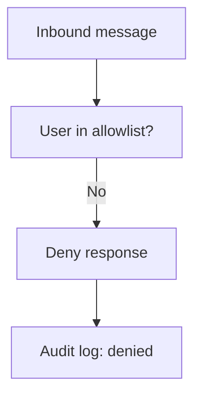
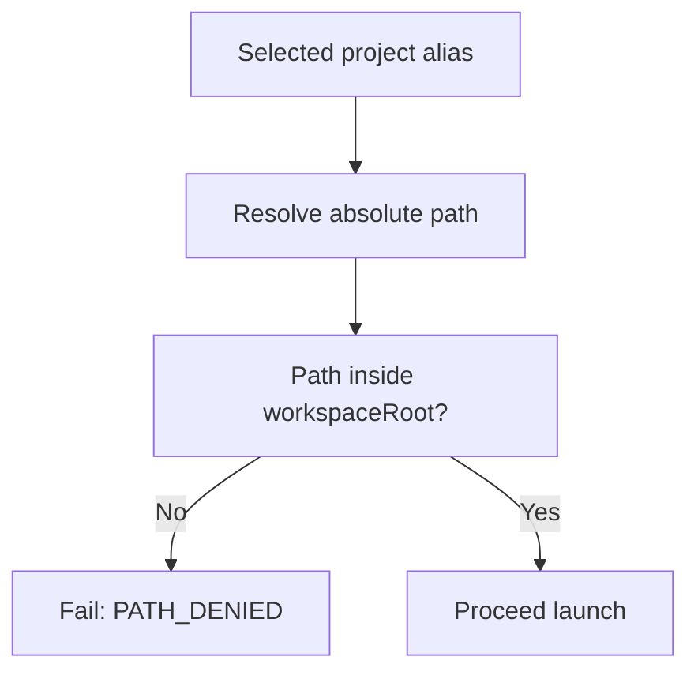
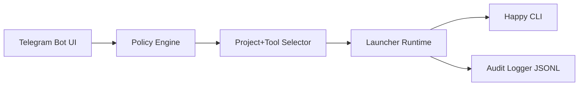

# PRD: Telegram Happy Dashboard Launcher (Independent Module)

## Document Info

| Field | Value |
|---|---|
| Product Name | Telegram Happy Dashboard Launcher |
| Version | 1.0 |
| Last Updated | 2026-02-16 |
| Status | Draft |
| Source Files | `idea.md`, `validate.md` |

---

## 1. Product Overview

### 1.1 Product Vision
Provide a secure Telegram-based launch dashboard that can start Happy sessions in local projects without modifying Happy itself.

### 1.2 Product Positioning
This product is a **local launch gateway**, not a remote shell. It should only execute fixed launch templates (`happy`, `happy codex`) after deterministic project/tool selection.

### 1.3 Target Users
- Solo developers running Happy on personal workstations/servers
- Small technical teams operating controlled internal machines

### 1.4 Business/Objectives (POC)
- Trigger Happy launch from Telegram in under 10 seconds
- Enforce strict policy controls (user/tool/path)
- Return clear status: started / failed with reason
- Keep implementation decoupled from Happy upstream updates

### 1.5 Success Metrics

| Metric | Target | Measurement |
|---|---|---|
| Launch command success rate | >= 95% in pilot runs | Audit log status counts |
| Median trigger-to-ack latency | <= 10s | Command timing logs |
| Unauthorized access attempts executed | 0 | Security/audit logs |
| Policy violations blocked | 100% | Deny event logs |
| Deterministic flow completion (project->tool->execute) | >= 98% | Bot interaction telemetry |

---

## 2. User Personas

### Persona A: Solo Builder (Primary)
- Runs multiple repos under one workspace root
- Wants to start a Happy session from phone quickly
- Needs confidence the bot won’t run arbitrary commands

### Persona B: Team Maintainer (Secondary)
- Configures allowlists and workspace boundaries
- Needs auditable history for who launched what
- Prioritizes stability across Linux/macOS hosts

### Persona C: Security-Conscious Operator
- Treats Telegram input as untrusted
- Requires explicit deny reasons and structured logs
- Rejects free-form command execution

---

## 3. Feature Requirements

### 3.1 MoSCoW Feature Matrix

| ID | Feature | Description | Priority | Acceptance Criteria |
|---|---|---|---|---|
| F1 | Allowlisted Telegram users | Only configured users can interact | Must | Non-allowlisted users denied with audit entry |
| F2 | Workspace project listing | List only directories under `workspaceRoot` | Must | No project outside root is shown |
| F3 | Tool allowlist | Select only configured tools (`claude`, optional `codex`) | Must | Tool choice restricted to policy |
| F4 | Fixed command templates | Execute only `happy` / `happy codex` templates | Must | No free-text command execution path |
| F5 | Deterministic Telegram UX | project -> tool -> execute -> status | Must | Flow completes without custom command input |
| F6 | Startup timeout + fail reasons | Standardized timeout and error taxonomy | Must | User gets clear failure reason category |
| F7 | Structured audit logs | Log user/project/tool/time/result/reason to dedicated folder | Must | Every launch attempt logged |
| F8 | Cross-platform launcher core | Linux + macOS support required; Windows optional | Must | Linux/macOS documented and tested |
| F9 | Happy independence | No changes in Happy codebase | Must | Integration via CLI invocation only |
| F10 | Launch lock/queue policy | One active launch lock | Could (deferred) | Explicitly out of POC scope |

### 3.2 Detailed Feature Specs

#### F1: User Allowlist Enforcement
**User Story:** As an operator, I want only known users to trigger launches.

**Acceptance Criteria:**
- [ ] `allowedTelegramUsers` policy exists in config
- [ ] Unknown users receive deny response
- [ ] Deny event logged with actor metadata

#### F2/F3: Project + Tool Selection
**User Story:** As an authorized user, I want to choose a project and tool from safe options.

**Acceptance Criteria:**
- [ ] `/projects` lists only directories under `workspaceRoot`
- [ ] `/launch` flow requires project selection then tool selection
- [ ] Tool list restricted by `allowedTools`

#### F4: Fixed Launch Templates
**User Story:** As an operator, I want zero arbitrary shell execution.

**Acceptance Criteria:**
- [ ] Claude template: `happy`
- [ ] Codex template: `happy codex`
- [ ] No free-text command parameter accepted

#### F6: Timeout + Fail Reasons
**User Story:** As a user, I want clear outcome when launch fails.

**Acceptance Criteria:**
- [ ] `startupTimeoutMs` policy applied
- [ ] Failures categorized (e.g., `TOOL_NOT_FOUND`, `PATH_DENIED`, `TIMEOUT`, `SPAWN_ERROR`)
- [ ] Telegram response includes concise reason

#### F7: Structured Audit Logging
**User Story:** As a maintainer, I want a full trace of launch attempts.

**Acceptance Criteria:**
- [ ] Configurable `auditLogDir`
- [ ] JSONL entries include: timestamp, telegramUserId, project, tool, commandTemplate, result, reason, durationMs
- [ ] Logs written for allow and deny outcomes

#### F8: Platform Support
**User Story:** As a maintainer, I want the same launcher behavior across Linux/macOS.

**Acceptance Criteria:**
- [ ] Linux support documented and tested
- [ ] macOS support documented and tested
- [ ] Windows marked optional; if implemented, documented caveats and tests

---

## 4. User Flows

### 4.1 Launch Flow (Happy Claude)
1. Authorized user sends `/launch`
2. Bot prompts project selection (from workspace)
3. Bot prompts tool selection (`claude`/`codex` as configured)
4. Bot resolves project path and validates policy
5. Bot executes fixed template in project directory
6. Bot replies with success/fail + reason category
7. Audit log entry is written

```mermaid
flowchart TD
  A[/launch] --> B[Validate user allowlist]
  B --> C[Show projects under workspaceRoot]
  C --> D[User selects project]
  D --> E[Show allowed tools]
  E --> F[User selects tool]
  F --> G[Resolve fixed template]
  G --> H[Execute with timeout]
  H --> I[Telegram status response]
  H --> J[Write audit log]
```

### 4.2 Deny Flow (Unauthorized User)


### 4.3 Project Boundary Validation Flow


---

## 5. Non-Functional Requirements

### 5.1 Security
- Zero arbitrary command execution
- Canonical path validation against `workspaceRoot`
- Strict user allowlist
- Structured audit logs for all actions
- Principle: **select-only, template-only** execution

### 5.2 Reliability
- Launch timeout enforced per request
- Clear fail reason taxonomy
- Idempotent log writing behavior on retries/failures

### 5.3 Performance
- Project list response <= 2s for typical workspace sizes (<200 repos)
- Trigger-to-ack median <= 10s
- Log write overhead negligible (<100ms typical)

### 5.4 Compatibility
- Required: Linux, macOS
- Optional: Windows (if command spawning complexity remains acceptable)

### 5.5 Operability
- Logs in dedicated folder with predictable schema
- Easy to rotate/archive logs later
- Config-driven behavior (no hardcoded personal values in code)

---

## 6. Technical Specifications

### 6.1 Architecture



### 6.2 Core Components
- **Bot Controller**: receives Telegram commands and manages deterministic steps
- **Policy Engine**: validates user/tool/path/timeouts
- **Workspace Scanner**: lists project directories under `workspaceRoot`
- **Launcher Runtime**: executes fixed templates in selected project context
- **Audit Logger**: writes structured JSONL events into `auditLogDir`

### 6.3 Configuration Schema (POC)
```json
{
  "workspaceRoot": "/path/to/workspace",
  "allowedTelegramUsers": [565844562],
  "allowedTools": ["claude", "codex"],
  "startupTimeoutMs": 8000,
  "auditLogDir": "./logs"
}
```

### 6.4 Command Template Mapping
- `tool=claude` -> `happy`
- `tool=codex` -> `happy codex`

No other tools/commands in POC.

### 6.5 Error Taxonomy (Initial)
- `UNAUTHORIZED_USER`
- `PROJECT_NOT_FOUND`
- `PATH_DENIED`
- `TOOL_NOT_ALLOWED`
- `TOOL_BINARY_NOT_FOUND`
- `SPAWN_ERROR`
- `STARTUP_TIMEOUT`

---

## 7. Analytics & Monitoring

### 7.1 Audit Event Fields
- `ts`
- `telegramUserId`
- `chatId`
- `selectedProject`
- `resolvedProjectPath`
- `selectedTool`
- `commandTemplate`
- `result` (`success` / `failure` / `denied`)
- `reasonCode`
- `durationMs`

### 7.2 Operational Metrics
- Daily launch count
- Success/failure ratio
- Top failure reasons
- Unauthorized attempt count

### 7.3 Alerts (Optional later)
- High failure spike over short window
- Repeated unauthorized attempts
- Missing Happy binary on host

---

## 8. Release Planning

### 8.1 MVP / POC Scope
- [ ] Config file with allowlists, workspace root, timeout, log dir
- [ ] `/projects` and `/launch` deterministic flow
- [ ] Fixed launch templates only (`happy`, `happy codex`)
- [ ] Timeout + reasoned status response
- [ ] Structured JSONL audit logs
- [ ] Linux/macOS verification

### 8.2 Post-POC Hardening
- [ ] Stronger startup detection semantics
- [ ] Policy unit tests and edge-case tests
- [ ] Optional Windows compatibility pass
- [ ] Log retention/rotation policy

### 8.3 Later Expansion
- [ ] Active launch lock / queueing
- [ ] Multi-machine routing
- [ ] Role-based permissions

---

## 9. Open Questions & Risks

### 9.1 Open Questions

| # | Question | Impact |
|---|---|---|
| 1 | Preferred implementation language (Node/TS vs Python)? | Medium |
| 2 | Exact startup success signal definition (process spawn vs first Happy handshake)? | High |
| 3 | Windows support timeline in POC? | Medium |
| 4 | Log retention/rotation policy for long-running usage? | Medium |

### 9.2 Risks

| Risk | Probability | Impact | Mitigation |
|---|---|---|---|
| Path traversal bug | Medium | High | Canonical path checks + tests |
| Telegram allowlist misconfiguration | Medium | High | Fail-safe defaults + startup validation |
| Launch failures due to host env drift | Medium | Medium | Health checks + clear reason codes |
| Windows process behavior mismatch | Medium | Medium | Keep optional until validated |

---

## 10. Appendix

### 10.1 Non-Goals (POC)
- No Happy upstream code modifications
- No arbitrary shell execution
- No custom user command input
- No per-user/per-project active lock in first POC

### 10.2 Glossary
- **Launch-and-forget**: trigger command and return status without long-running session tracking in bot
- **Template-only execution**: bot executes only predefined command templates
- **Workspace boundary**: path security boundary defined by `workspaceRoot`

### 10.3 Revision History

| Version | Date | Author | Changes |
|---|---|---|---|
| 1.0 | 2026-02-16 | Olak | Initial PRD generated from finalized idea and validation decisions |
